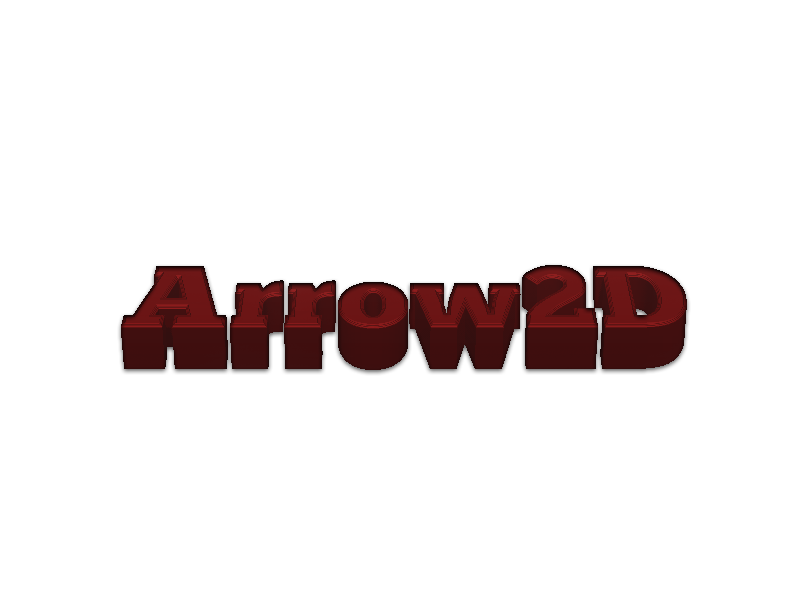
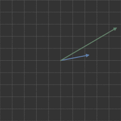
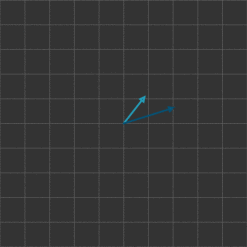
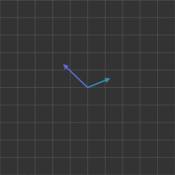

<h1 align="center"><b>Arrow2D library</b></h1>

<div align="center">
    
</div>

<h3 align="center"><b>Arrow2D is a library specific to 2D vector operations.</b></h3>

# Quick start

```javascript
const { CreateVector, StaticArrow2D } = require('Arrow2D');

//Create a VectorForm vector.
const vector1 = CreateVector(5, 2);
const vector2 = CreateVector(2, 5);
const vector3 = StaticArrow2D.add(vector1, vector2);

//Create an ArrayForm vector.
const arrayVector = CreateVector(5, 2, true)
const arrayVector2 = StaticArrow2D.add(vector1, [2, 5]);
```


# Operations


## normalize()

Normalizes the vector, turning it into a unit vector.

**Example**
```javascript
const vector = CreateVector(5, 2);
vector.normalize(); // Normalize the vector. 
```
;

## add(vectorToAdd)

Adds another vector components into the current vector.

**Example**
```javascript
const vector1 = CreateVector(5, 2);
const vector2 = CreateVector(2, 5);
vector1.add(vector2); // Adds vector2 to vector1
```
;

## sub(vectorToSubtract)

Subtracts another vector components from the current vector.

**Example**
```javascript
const vector1 = CreateVector(5, 2);
const vector2 = CreateVector(2, 5);
vector1.sub(vector2); // Subtracts vector2 from vector1
```
;

## scalarMult(scalar)

Multiplies the current vector components with a scalar.

**Example**
```javascript
const vector = CreateVector(5, 2);
const scalar = 2;
vector1.scalarMult(scalar); // Multiply vector by scalar.
```

## scalarDiv(scalar)

Divides the current vector components with a scalar.

**Example**
```javascript
const vector = CreateVector(5, 2);
const scalar = 2;
vector1.scalarDiv(scalar); // Divide vector by scalar.
```
;

## add(firstVector, secondVector) - STATIC

Static version of add.

Add the components of two vectors and returns a new one.

**Example**
```javascript
const vector1 = CreateVector(5, 2);
const vector2 = CreateVectorr(2, 5);
const vector3 = StaticArrow2D.add(vector1, vector2); // Add vectors and return a new one.
```

;

## sub(firstVector, secondVector) - STATIC

Static version of sub.

Subtracts the components of two vectors and return a new one.

**Example**
```javascript
const vector1 = CreateVector(5, 2);
const vector2 = CreateVector(2, 5);
const vector3 = StaticArrow2D.sub(vector1, vector2); // Subtract vectors and return a new one.
```

;

## dotProduct(firstVector, secondVector) - STATIC

Returns a scalar value from the dot product of two vectors.

**Example**
```javascript
const vector1 = CreateVector(5, 2);
const vector2 = CreateVector(2, 5);
const result = StaticArrow2D.dotProduct(vector1, vector2); // Returns a scalar.
```

## scalarDiv(vector, scalar) - STATIC

Static version of scalarDiv.

Divides a vector by a scalar and returns a new one.

**Example**
```javascript
const vector1 = CreateVector(5, 2);
const scalar = CreateVector(2, 5);
const vector3 = StaticArrow2D.scalarDiv(vector1, scalar); // Returns a new vector divided by the scalar.
```

# Utils

## constrainMagnitude()

Constrain the magnitude of the vector to a value.

**Example**
```javascript
const vector = CreateVector(5, 2);
vector.constrainMagnitude(3); // Constrains the magnitude of the vector to 3.
```

## heading()

Returns the direction the vector is pointing.

**Example**
```javascript
const vector1 = CreateVector(5, 2);
const direction = vector1.heading();
```

## rotate(angle)

Rotate the vector by an angle.

**Example**
```javascript
const vector = CreateVector(5, 2);
vector.rotate(PI/2); // Rotate vector by 90 degrees.
```

## vectorToArray(vector) - STATIC 

Returns the array form of a vector.
The operations that take a vector as an input will receive an array instead.

**Example**
```javascript
const vector = CreateVector(5, 2);
const array = StaticArrow2D.vectorToArray(vector);
```

## arrayToVector(array) - STATIC

Returns the vector form of an array.

**Example**
```javascript
const array = [5, 2];
const vector = StaticArrow2D.arrayToVector(array);
```

## angleBetween(firstVector, secondVector, degrees) - STATIC

Returns the angle, in radians, between two vectors.
If you want the angle in degress, set "degress" to true.

**Example**
```javascript
const vector1 = CreateVector(5, 2);
const vector2 = CreateVector(2, 5);
const angle = StaticArrow2D.angleBetween(vector1, vector2);
```

## orthogonalVector(vector) - STATIC

Returns an orthogonal vector to the input vector.

**Example**
```javascript
const vector = CreateVector(5, 2);
const orthogonal = StaticArrow2D.orthogonalVector(vector);
```